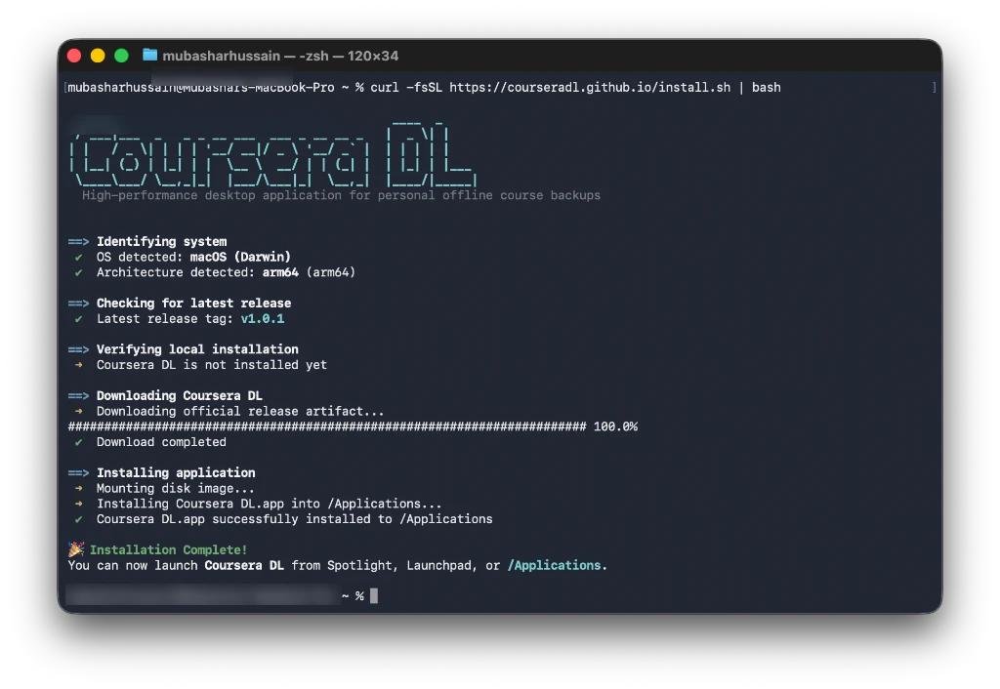
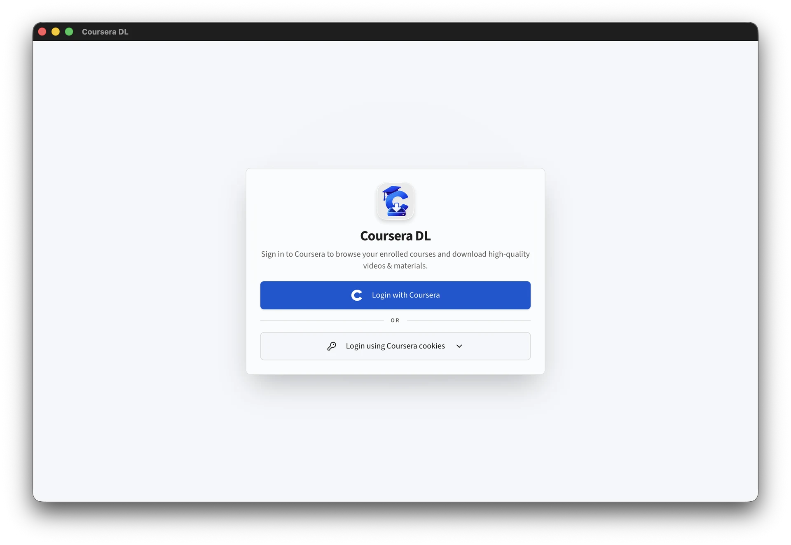
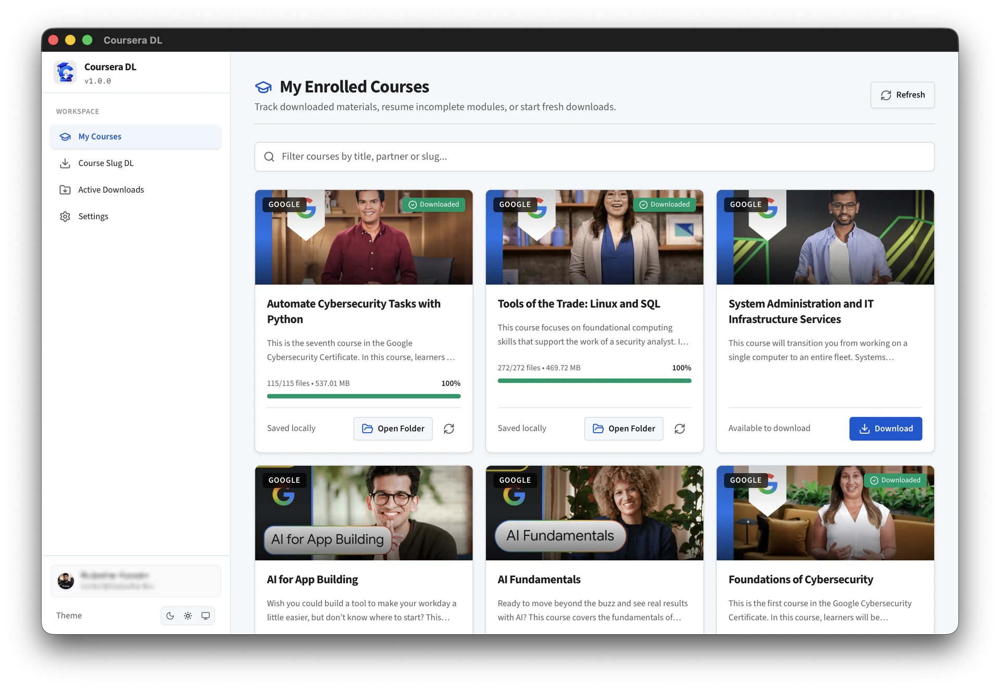
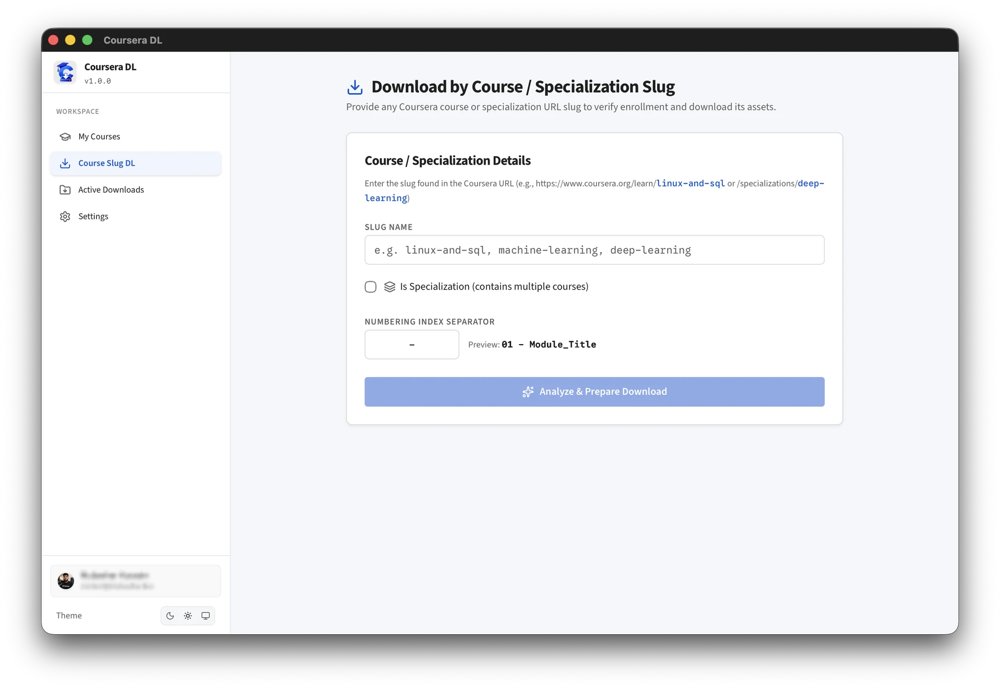
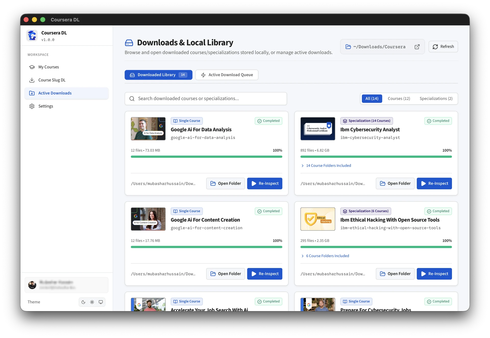
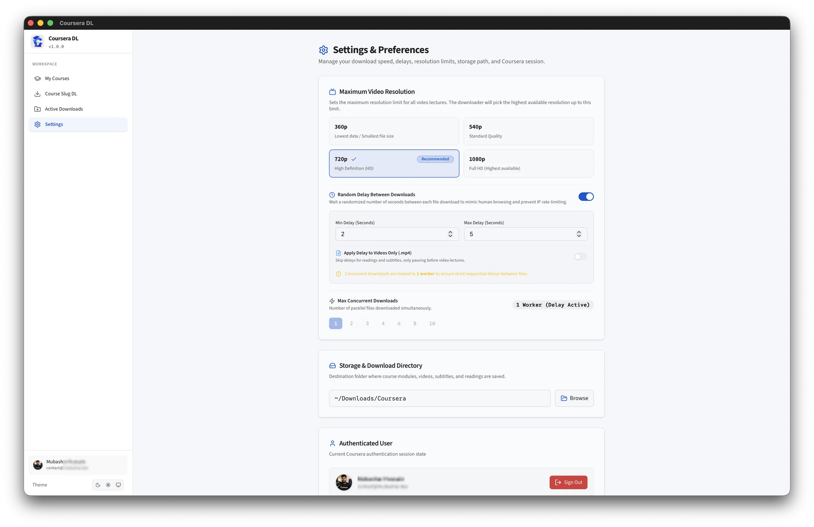

# Coursera DL

<p align="center">
  
</p>

<h3 align="center">High-Performance Coursera Course Downloader & Personal Offline Backup Tool</h3>

<p align="center">
  A fast, lightweight, and user-friendly desktop application to download your enrolled Coursera courses, 1080p/720p HD videos, PDF slides, and subtitles for offline learning.
</p>

<p align="center">
  <a href="https://github.com/courseradl/coursera-dl-gui/releases"></a>
  <a href="https://tauri.app/"></a>
  <a href="https://www.rust-lang.org/"></a>
  <a href="LICENSE"></a>
  <a href="https://courseradl.github.io/"></a>
</p>

---

## Quick Installation

Install or update **Coursera DL** instantly on your workstation with a single terminal command:

### macOS / Linux

```bash
curl -fsSL https://courseradl.github.io/install.sh | bash
```

### Windows (PowerShell)

```powershell
irm https://courseradl.github.io/install.ps1 | iex
```

### Terminal Installation Output

<p align="center">
  
</p>

---

## Overview

**Coursera DL** is a native desktop application designed to replace broken legacy Python command-line scripts. Built with a **Rust & Tauri v2** backend and a modern React UI, it lets you archive your enrolled Coursera courses with a single click—keeping your learning materials accessible anywhere, anytime, without buffering or Internet dependence.

<p align="center">
  
</p>

---

## Key Features

- **1-Click Direct Coursera Login**: Sign in directly through an embedded, secure Coursera login window with automatic session detection—no manual cookie extraction required.
- **Manual Cookie Support**: Power users can also authenticate using session cookies (`CAUTH` or `cookies.txt`).
- **High-Quality Video Downloads**: Save lectures in full 1080p or 720p MP4 formats.
- **Multilingual Subtitles**: Automatically extract and organize subtitles in `.vtt` and `.srt` formats.
- **PDF Slides & Lecture Notes**: Automatically download course reading materials, lecture slides, and transcripts.
- **Batch Specialization Discovery**: Enter a course or specialization slug to map out all nested modules and download complete syllabi in one click.
- **Smart Throttling & Human Pacing**: Built-in randomized request delays and throttling protect your account from rate-limiting.
- **Offline Library Management**: View your downloaded courses, inspect completed file counts, resume partial downloads, and open destination folders directly.

---

## App Walkthrough & Screenshots

### 1. Simple Authentication

Sign in effortlessly using the built-in direct login window or paste your session cookies:

<p align="center">
  
</p>

---

### 2. Enrolled Courses Library

Once logged in, Coursera DL automatically synchronizes all your enrolled courses for quick one-click downloading:

<p align="center">
  
</p>

---

### 3. Download by Course Slug

Paste any Coursera course or specialization URL/slug to fetch the full syllabus and download complete modules:

<p align="center">
  
</p>

---

### 4. Active Downloads & Offline Library

Track progress in real time, view completed lesson counts, resume interrupted tasks, and open files directly on your computer:

<p align="center">
  
</p>

---

### 5. Settings & Delay Throttling

Customize download directories, configure human-mimicking delay ranges between requests, and adjust video quality preferences:

<p align="center">
  
</p>

---

## Step-by-Step Usage

1. **Launch the App**: Open **Coursera DL** on your desktop.
2. **Log In**:
   - **Method A (Recommended)**: Click **Login with Coursera**, enter your credentials in the popup window, and the session will be detected automatically.
   - **Method B (Cookies)**: Paste your `CAUTH` cookie into the manual cookie box and click **Login with cookies**.
3. **Select Course**: Choose a course from **My Courses** or paste a URL/slug in **Course Slug DL**.
4. **Choose Destination**: Set your preferred download directory.
5. **Start Download**: Click **Download Course** to archive videos, reading materials, slides, and subtitles.

---

## Development & Building from Source

If you want to contribute or build the application from source:

### Prerequisites

- **Rust**: [Install rustup](https://rustup.rs/) (Stable channel)
- **Node.js**: [Install Node.js (LTS)](https://nodejs.org/) or [pnpm](https://pnpm.io/)
- **C Compiler**: Follow the [Tauri Prerequisites Guide](https://tauri.app/start/prerequisites/) for your operating system.

### 1. Clone the Repository

```bash
git clone https://github.com/courseradl/coursera-dl-gui.git
cd coursera-dl-gui
```

### 2. Install Dependencies

```bash
pnpm install
# or: npm install
```

### 3. Run in Development Mode

```bash
pnpm tauri dev
# or: npm run tauri dev
```

### 4. Build Release Package

```bash
pnpm tauri build
# or: npm run tauri build
```

Compiled application binaries and platform installers (`.dmg`, `.msi`, `.deb`, `.AppImage`) will be generated under `src-tauri/target/release/bundle/`.

---

## Community & Contributing

Contributions are welcome! Please check out the [Contributing Guidelines](CONTRIBUTING.md) before submitting a pull request.

- **Issues & Bug Reports**: [GitHub Issues](https://github.com/courseradl/coursera-dl-gui/issues)
- **Changelog**: [Release Notes & Updates](https://courseradl.github.io/changelog.html)
- **Code of Conduct**: [CODE_OF_CONDUCT.md](CODE_OF_CONDUCT.md)
- **Security Policy**: [SECURITY.md](SECURITY.md)

---

## Legal Disclaimer

This software is an independent, community-driven utility created strictly for **personal, offline educational archiving** of learning materials that the user has already legitimately enrolled in and holds authorized access to view.

This project is not affiliated with, endorsed by, or associated with Coursera Inc. The author and contributors assume no liability for misuse, terms of service violations, or account issues resulting from the use of this software. Distributed under the [GNU General Public License v3.0 (GPL-3.0)](LICENSE).
